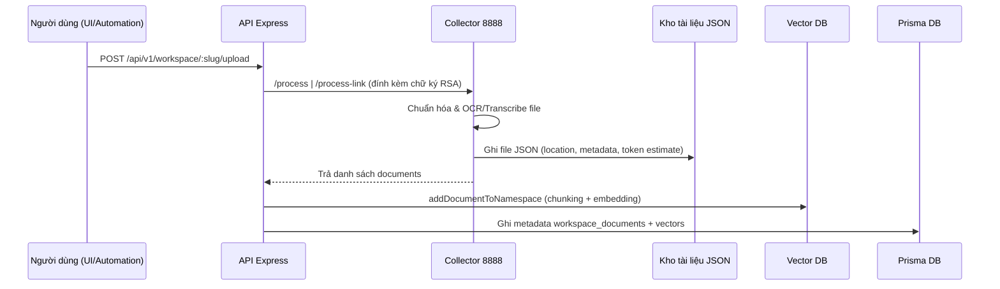
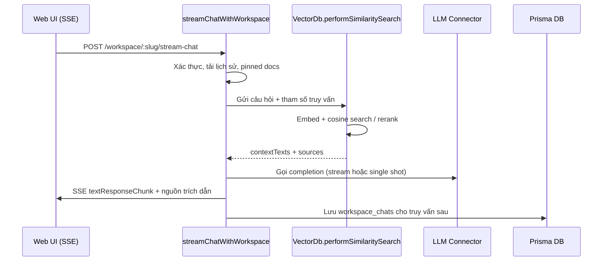
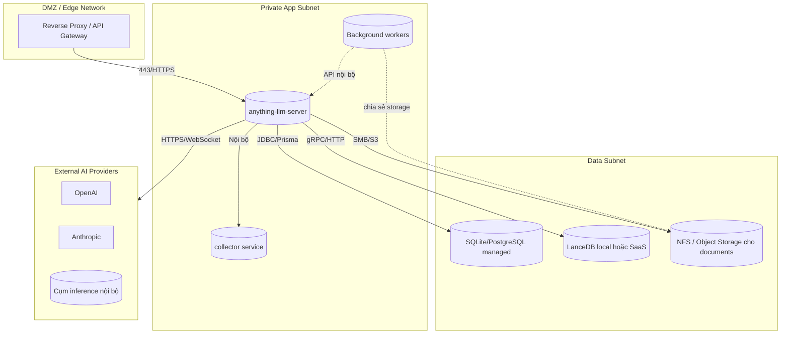

# Sơ đồ kiến trúc hệ thống AnythingLLM

Tài liệu này mô tả kiến trúc tham chiếu của AnythingLLM nhằm hỗ trợ các nhóm vận hành (System Architect, SysAdmin, DBA, Network) triển khai ứng dụng trong môi trường doanh nghiệp. Các sơ đồ sử dụng Mermaid có thể được chèn trực tiếp vào tài liệu nội bộ hoặc trình chiếu.

## 1. Kiến trúc tổng quan

### 1.1 Bức tranh thành phần
```mermaid
flowchart LR
    subgraph Client[Trải nghiệm người dùng]
        Browser[Trình duyệt Web UI]
        Embed[Widget nhúng & Extension]
    end

    subgraph Edge[Tầng biên mạng công ty]
        LB[Reverse Proxy / WAF]
    end

    subgraph Core[Dịch vụ AnythingLLM]
        FE[Frontend tĩnh (Vite/React build)]
        API[API & Orchestrator (Express + Prisma)]
        BG[Background Workers (Bree)]
        COL[Collector Service (Express 8888)]
    end

    subgraph Storage[Tầng dữ liệu]
        DocStore[(Kho tài liệu JSON trên đĩa)]
        SQL[(CSDL quan hệ\nSQLite hoặc PostgreSQL)]
        VecDB[(Vector DB\nLanceDB/Pinecone/...)]
        Cache[(Vector Cache & Artifact)]
    end

    subgraph External[Dịch vụ AI bên ngoài]
        LLM[(LLM Providers\nOpenAI/Anthropic/Ollama/...)]
        Embedder[(Embedding Engines)]
    end

    Browser -- HTTPS/SSE --> LB
    Embed -- HTTPS --> LB
    LB -- phục vụ SPA --> FE
    LB -- REST/SSE/WebSocket --> API
    API <--> BG
    API <---> SQL
    API <---> VecDB
    API <-- Disk IO --> DocStore
    API <---> Cache
    API <-- HTTPS --> LLM
    API <-- HTTPS --> Embedder
    API <-.nội bộ có chữ ký .-> COL
    COL --> DocStore
```

### 1.2 Diễn giải
- **Frontend**: Ứng dụng Vite/React được build thành file tĩnh và có thể phục vụ qua Node (Express) hoặc proxy HTTP/S bên ngoài.
- **API & Orchestrator**: Máy chủ Express chịu trách nhiệm xác thực, điều phối vector DB, kết nối LLM, SSE streaming và các webhook nội bộ.
- **Collector Service**: Microservice Express lắng nghe `COLLECTOR_PORT` (mặc định 8888) dùng để ingest file, link, hoặc text và lưu thành JSON chuẩn hóa cho máy chủ xử lý.
- **Kho dữ liệu**: Tài liệu JSON và cache embeddings nằm trong `server/storage`, Prisma mặc định sử dụng SQLite nhưng có thể chuyển sang PostgreSQL, và vector DB có thể là LanceDB (cục bộ) hoặc dịch vụ quản lý (Pinecone, Chroma, Milvus...).
- **Background workers**: Bree scheduler xử lý công việc định kỳ như đồng bộ nguồn tài liệu theo dõi và dọn dẹp dữ liệu mồ côi.
- **Kết nối AI**: Lớp `AiProviders` và `EmbeddingEngines` chuẩn hóa kết nối tới nhiều nhà cung cấp LLM/embedding (OpenAI, Anthropic, Ollama, GPU nội bộ...).
- **Bảo mật Collector**: Server ký và mã hóa payload bằng `CommunicationKey` & `EncryptionManager` trước khi chuyển tới Collector; collector bỏ qua các request không được ký hợp lệ.

## 2. Luồng dữ liệu chính

### 2.1 Nạp liệu (Collector-driven)


### 2.2 Phiên chat & truy hồi kiến thức


### 2.3 Đồng bộ nguồn được theo dõi
- Worker `sync-watched-documents` gọi lại Collector theo lịch để làm mới nội dung các nguồn đã cấu hình (`watched`), đảm bảo vector DB và metadata được cập nhật.

## 3. Mô hình triển khai tham chiếu



**Khuyến nghị vận hành:**
- Đặt Collector trong mạng nội bộ, không mở port 8888 ra ngoài Internet; chỉ cho phép API server truy cập.
- Sử dụng reverse proxy (Nginx, Traefik, AWS ALB...) để kết thúc TLS và ánh xạ `/api` tới API server, `/` tới nội dung tĩnh đã build.
- Mount thư mục `server/storage` vào volume/dịch vụ lưu trữ dùng chung để API, Collector và worker cùng truy cập.
- Với LanceDB cục bộ, đảm bảo dung lượng đĩa và IOPS phù hợp; với dịch vụ SaaS (Pinecone, Weaviate, Milvus Cloud...) mở outbound HTTPS từ subnet ứng dụng.

## 4. Checklist theo vai trò

### 4.1 System Architect / SysAdmin
- Lựa chọn mô hình triển khai (bare metal, Docker Compose, K8s) và phân tách process `server`, `collector`, `worker` thành service riêng để scale độc lập.
- Đảm bảo biến môi trường `STORAGE_DIR`, `SERVER_PORT`, `COLLECTOR_PORT`, `VECTOR_DB`, `EMBEDDING_ENGINE` được quản lý trong secret store hoặc config map.
- Thiết lập cơ chế giám sát log & healthcheck trên port API (SSE), worker (Bree) và collector (`/accepts`, `/process`).

### 4.2 Database Administrator
- Chuẩn bị cơ sở dữ liệu Prisma: mặc định SQLite file `anythingllm.db`, có thể chuyển sang PostgreSQL bằng cách cập nhật `datasource db` và chạy `yarn prisma:setup`.
- Thiết lập backup định kỳ cho kho tài liệu JSON, file LanceDB và database quan hệ để bảo toàn embedding + metadata.
- Giám sát kích thước bảng `workspace_documents`, `document_vectors`, `workspace_chats` để tối ưu retention.

### 4.3 Network / Security Engineer
- Mở inbound duy nhất: `443 -> reverse proxy -> SERVER_PORT (mặc định 3001)`; đóng port 8888 ra ngoài, chỉ allow nội bộ.
- Cho outbound HTTPS tới nhà cung cấp LLM/embedding cần dùng (OpenAI, Anthropic, Azure OpenAI, Ollama nội bộ...).
- Bật HTTPS nội bộ của ứng dụng bằng cách cung cấp `HTTPS_KEY_PATH`, `HTTPS_CERT_PATH` nếu muốn API server tự terminate TLS.
- Theo dõi khóa RSA (CommunicationKey) được hệ thống tự xoay vòng mỗi lần khởi động; đồng bộ thư mục `server/storage/comkey` giữa các replica (hoặc mount chung) nếu chạy scale-out.

## 5. Biến môi trường quan trọng
| Biến | Mục đích |
| --- | --- |
| `SERVER_PORT` | Port API Express phục vụ REST/SSE/WebSocket (mặc định 3001). |
| `COLLECTOR_PORT` | Port Collector service (mặc định 8888). |
| `STORAGE_DIR` | Đường dẫn chia sẻ chứa documents, cache, LanceDB, comkey. |
| `VECTOR_DB` | Lựa chọn backend vector (lance, pinecone, weaviate, qdrant, pgvector...). |
| `EMBEDDING_ENGINE` | Engine embedding cho chunking (OpenAI, local, NVIDIA NIM...). |
| `ENABLE_HTTPS`, `HTTPS_KEY_PATH`, `HTTPS_CERT_PATH` | Bật HTTPS trực tiếp tại API server khi cần. |
| `ANYTHINGLLM_CHROMIUM_ARGS`, `COLLECTOR_ALLOW_ANY_IP` | Tinh chỉnh hành vi Collector khi scrape web. |

## 6. Lộ trình mở rộng
- **Scale ngang API**: đặt nhiều replica API phía sau load balancer; chia sẻ `server/storage` qua NFS/S3 và dùng DB managed.
- **Scale vector DB**: chuyển từ LanceDB cục bộ sang dịch vụ cloud hoặc cluster nội bộ khi số lượng tài liệu tăng; cấu hình qua env `VECTOR_DB`.
- **Edge caching**: build frontend tĩnh và cache qua CDN để giảm tải cho API server.
- **Quản trị cấu hình**: tích hợp với hệ thống secret manager (Vault, AWS Secrets Manager) để cung cấp API key LLM, thay vì lưu plaintext trong `.env`.

---
Tài liệu này có thể được điều chỉnh theo yêu cầu của doanh nghiệp (K8s, multi-region, air-gap...). Khi tùy biến, đảm bảo duy trì các ràng buộc an ninh: Collector chỉ nhận request ký bởi API server, thư mục `server/storage` được mount đọc/ghi cho cả ba tiến trình (API, Collector, Worker), và outbound tới nhà cung cấp LLM/Vector tuân thủ chính sách bảo mật nội bộ.
