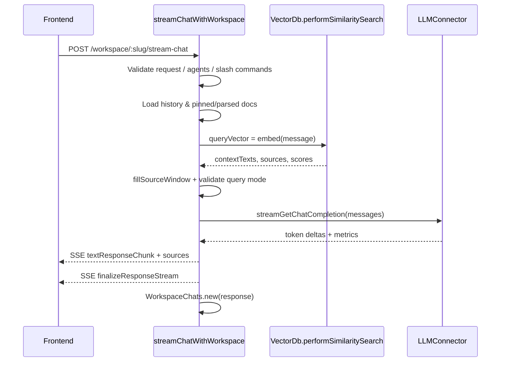

# Vector Database Pipeline

## End-to-end overview
The vector workflow spans the collector service, the main server, and the pluggable vector database provider. At a high level:

```mermaid
graph LR
  subgraph Collector
    A[Upload/link/raw text request]\n/process] --> B[File/link/text converters]
    B --> C[JSON document written to storage]
  end
  subgraph Server
    D[Workspace update-embeddings API] --> E[Document.addDocuments]
    E --> F[getVectorDbClass]
    F --> G[Vector provider addDocumentToNamespace]
    G --> H[(Vector DB namespace)]
    H --> I[performSimilaritySearch]
    I --> J[Chat streaming handlers]
  end
  C --> D
```

## Ingestion entrypoints
* The collector exposes `/process`, `/parse`, `/process-link`, and `/process-raw-text` endpoints (all behind payload integrity checks) that accept uploads or scraping jobs, normalize the request, and funnel them into the appropriate parser.【F:collector/index.js†L43-L176】
* Each upload is resolved relative to a hot directory, validated (path traversal, reserved filenames, supported extension), and then dispatched to a converter preset selected from `SUPPORTED_FILETYPE_CONVERTERS` so different media types share a uniform output structure.【F:collector/processSingleFile/index.js†L23-L82】

## Conversion & metadata capture
* Converters such as the PDF preset load or OCR the source, collapse per-page text, enrich metadata (title, author, publication time, source URIs), estimate token counts, and finally emit a JSON payload ready for embedding.【F:collector/processSingleFile/convert/asPDF/index.js†L12-L83】
* `writeToServerDocuments` persists this payload under `server/storage/documents/<folder>/<slug>.json` (or the direct-upload area when parsing only), guaranteeing the directory exists and returning a relative `location` that the API can later reference.【F:collector/utils/files/index.js†L5-L148】

## Server-side embedding orchestration
* When the UI or automation posts to `/v1/workspace/:slug/update-embeddings`, the server loads each referenced JSON via `fileData`, generates a new `docId`, and records the metadata row for the workspace before or after vectorization.【F:server/models/documents.js†L83-L144】【F:server/utils/files/index.js†L19-L34】
* The active vector backend is resolved at runtime with `getVectorDbClass`, allowing Pinecone, LanceDB, Chroma, pgvector, and others to plug into the same lifecycle.【F:server/utils/helpers/index.js†L78-L119】

## Chunking, embedding, and provider commits
* Providers follow the same pattern: check for cached vectors, otherwise split text with a `TextSplitter` (respecting system settings for chunk size/overlap and any embedder-specific prefixes), call the configured embedder engine, and batch the resulting vectors for ingestion.【F:server/utils/vectorDbProviders/lance/index.js†L252-L343】
* The LanceDB implementation is representative—after chunking it either writes cached submissions straight into the namespace or issues a fresh `vectorSearch` add, storing both the inserted vectors and a copy of the serialized chunks for future reuse.【F:server/utils/vectorDbProviders/lance/index.js†L290-L343】【F:server/utils/files/index.js†L162-L200】
* Every vector chunk is linked back to the logical document through `DocumentVectors.bulkInsert`, so subsequent deletes or sync jobs can map workspace documents to vector IDs quickly.【F:server/models/vectors.js†L5-L34】

## Vector caching & hygiene
* The cache layer hashes each `folder/filename` pair, letting the server skip expensive re-embeds when rerunning ingestion or syncing watched sources; helpers also support purging cache entries when documents are removed.【F:server/utils/files/index.js†L162-L225】
* Removing a document triggers provider-specific deletion plus cleanup of `workspace_documents` and `document_vectors` records, ensuring the namespace doesn’t accumulate orphan vectors.【F:server/models/documents.js†L147-L183】

## Retrieval flow during chat

### 1. Request enters the system
1. The browser sends `POST /workspace/:slug/stream-chat` (or the thread variant). The endpoint authenticates the session, enforces role- and quota-based guards, upgrades the response to Server-Sent Events (SSE), and hands off to `streamChatWithWorkspace`.【F:server/endpoints/chat.js†L23-L118】
2. The streaming helper expands slash commands/agents, resolves the workspace-specific LLM connector and vector provider, and performs early exits if the workspace has no embeddings but the user is in strict "query" mode.【F:server/utils/chats/stream.js†L21-L109】

### 2. Context assembly before vector search
3. `DocumentManager` hydrates pinned documents, capturing their identifiers so vector search can avoid returning duplicate passages; these snippets are pre-seeded into the `contextTexts` array and surfaced to the client as high-priority sources.【F:server/utils/chats/stream.js†L109-L133】
4. Parsed file uploads attached to the chat are appended as additional context chunks, keeping their metadata so the UI can cite them in the final answer.【F:server/utils/chats/stream.js†L134-L148】【F:server/models/workspaceParsedFiles.js†L191-L222】
5. Chat history is retrieved and token-budgeted alongside the upcoming system and user prompts so the LLM prompt fits inside the provider's window later in the flow.【F:server/utils/chats/stream.js†L92-L109】【F:server/utils/helpers/chat/index.js†L1-L120】

### 3. Vector database retrieval execution
6. `performSimilaritySearch` is invoked only if the namespace contains vectors. The call packages the workspace slug, the normalized user question, similarity threshold, `topN`, rerank preference, and pinned-document filters so provider logic can respect workspace tuning.【F:server/utils/chats/stream.js†L150-L165】
7. Inside the LanceDB provider (the default), the query text is embedded using the same LLM connector so embedding space stays aligned with the ingest path.【F:server/utils/vectorDbProviders/lance/index.js†L310-L342】
8. The provider chooses one of two execution branches:
   * **Similarity mode:** run a cosine search limited to `topN` results, discard matches below the threshold, and drop any chunk originating from a pinned document to prevent duplicate context.【F:server/utils/vectorDbProviders/lance/index.js†L142-L204】
   * **Rerank mode:** widen the candidate pool (10–50, depending on corpus size), fetch cosine-ranked vectors, and re-score them with the native embedding reranker before applying thresholds and filters. This boosts precision for dense workspaces without overwhelming the prompt budget.【F:server/utils/vectorDbProviders/lance/index.js†L41-L141】
9. Each surviving match is converted into `{contextTexts, sources}`. `contextTexts` feeds directly into the prompt compressor, while `sources` is curated metadata (including page/URI/title) used for UI citations, telemetry, and auditing.【F:server/utils/vectorDbProviders/lance/index.js†L205-L275】【F:server/utils/vectorDbProviders/lance/index.js†L383-L433】

### 4. Validation and fallback logic
10. If the provider reports an error or the namespace is missing, the chat flow emits an SSE "abort" chunk and stops processing to avoid hallucinated answers.【F:server/utils/vectorDbProviders/lance/index.js†L395-L432】【F:server/utils/chats/stream.js†L167-L177】
11. After vector search, `fillSourceWindow` re-checks recent chat history, trims duplicates, and ensures the combined source list respects workspace display limits before finalizing the context payload.【F:server/utils/chats/stream.js†L180-L197】【F:server/utils/helpers/chat/index.js†L382-L441】
12. In query mode with zero contextual chunks (even after pins, parsed files, and vector retrieval), the system refuses to answer and logs the interaction, forcing the user to add relevant data instead of hallucinating.【F:server/utils/chats/stream.js†L198-L227】

### 5. Answer synthesis and delivery
13. The LLM connector composes the full prompt (system instructions + user question + curated context + history) using the compressor described earlier. Depending on provider capabilities, it either streams tokens chunk-by-chunk or returns a single completion.【F:server/utils/chats/stream.js†L229-L275】【F:server/utils/helpers/chat/index.js†L1-L200】
14. Each chunk is written to the SSE stream with associated sources; once the response is complete, the transcript and source metadata are persisted to the `workspace_chats` table for future retrieval and analytics.【F:server/utils/chats/stream.js†L253-L307】【F:server/models/workspaceChats.js†L5-L30】【F:server/utils/helpers/chat/responses.js†L19-L118】

## Key configuration levers
* Workspace settings drive search depth (`topN`), similarity cutoffs, and rerank toggles; System Settings govern chunk size/overlap so larger embeddings can be dialed back for narrow context windows.【F:server/utils/chats/stream.js†L150-L199】【F:server/utils/vectorDbProviders/lance/index.js†L252-L310】
* Environment variables such as `VECTOR_DB`, `EMBEDDING_ENGINE`, and provider-specific credentials determine which backend and embedder are instantiated via the helper factories.【F:server/utils/helpers/index.js†L78-L160】

## Operational considerations for new contributors
* Collector converters should always populate `chunkSource` and other metadata fields because vector filtering and reranking rely on them to deduplicate results and support document watching/resyncing.【F:collector/processSingleFile/convert/asPDF/index.js†L55-L83】
* When adding a new vector backend, implement the same caching, chunking, and cleanup hooks (`addDocumentToNamespace`, `deleteDocumentFromNamespace`, `performSimilaritySearch`) so the rest of the stack continues to treat it interchangeably.【F:server/models/documents.js†L83-L183】【F:server/utils/vectorDbProviders/lance/index.js†L252-L433】

### Detailed call stack from request to response
* **Endpoint setup** – `chatEndpoints` registers the SSE routes, validates the request body, sets streaming headers, and writes quota-related abort chunks when necessary before delegating to the workspace handler.【F:server/endpoints/chat.js†L24-L118】
* **Command & agent handling** – `streamChatWithWorkspace` first resolves slash commands and agent invocations; agent flows short-circuit the standard retrieval path entirely, preventing unnecessary vector hits.【F:server/utils/chats/stream.js†L27-L51】
* **Provider resolution & namespace checks** – The helper binds the workspace-configured LLM provider and resolves the vector provider (default LanceDB) through `getVectorDbClass`, then verifies that the workspace namespace exists and contains embeddings before continuing.【F:server/utils/chats/stream.js†L53-L93】【F:server/utils/helpers/index.js†L78-L135】
* **History loading & context seeding** – `recentChatHistory`, `DocumentManager.pinnedDocs`, and `WorkspaceParsedFiles.getContextFiles` jointly populate the in-memory context arrays and produce `pinnedDocIdentifiers` that will suppress duplicate chunks later in the flow.【F:server/utils/chats/stream.js†L94-L156】【F:server/utils/chats/index.js†L61-L81】【F:server/utils/DocumentManager/index.js†L20-L69】【F:server/models/workspaceParsedFiles.js†L191-L222】
* **Vector search execution** – `performSimilaritySearch` packages the user message, similarity settings, and pinned-document filters into a single provider call and inspects the returned `{contextTexts, sources, message}` contract to determine success.【F:server/utils/chats/stream.js†L150-L177】【F:server/utils/vectorDbProviders/lance/index.js†L383-L433】
* **Prompt construction & streaming** – Once vector retrieval succeeds, the handler merges newly curated context with history via `fillSourceWindow`, compresses the final prompt, streams tokens (or a single completion), and persists the conversation for future context re-use.【F:server/utils/chats/stream.js†L180-L307】【F:server/utils/helpers/chat/index.js†L360-L441】【F:server/models/workspaceChats.js†L5-L30】

### LanceDB similarity & rerank pipeline in detail
* **Embedding parity** – The provider uses `LLMConnector.embedTextInput` to ensure the query vector lives in the same embedding space as the stored document vectors; no additional embedder wiring is required because the connector already carries the workspace embedder instance.【F:server/utils/vectorDbProviders/lance/index.js†L383-L415】【F:server/utils/helpers/index.js†L120-L176】
* **Distance normalization** – Raw LanceDB cosine distances are converted to similarity scores through `distanceToSimilarity`, normalizing the value range and allowing consistent threshold comparisons even if the backend returns negative cosine values.【F:server/utils/vectorDbProviders/lance/index.js†L29-L34】
* **Adaptive candidate window** – Rerank mode widens the search window to 10–50 documents (10% of the namespace capped at 50) before invoking `NativeEmbeddingReranker`, trading a small latency hit for better precision on dense workspaces.【F:server/utils/vectorDbProviders/lance/index.js†L82-L141】
* **Pinned-document filtering** – Both the similarity and rerank branches skip any chunk whose `sourceIdentifier` matches a pinned document so the final prompt does not waste tokens repeating material already injected manually.【F:server/utils/vectorDbProviders/lance/index.js†L118-L195】【F:server/utils/chats/index.js†L102-L110】
* **Source curation** – `curateSources` strips LanceDB-specific fields, leaving a clean metadata payload (title, URL, snippet, score) that the UI can surface directly, while `fillSourceWindow` can backfill older citations when the latest search returns fewer than `topN` items.【F:server/utils/vectorDbProviders/lance/index.js†L424-L475】【F:server/utils/helpers/chat/index.js†L382-L441】

### Context validation and refusal paths
* **Query mode guardrails** – If the workspace is in `query` mode and the assembled `contextTexts` array ends up empty (no pins, parsed files, or vector matches), the handler emits a refusal response with the workspace’s custom message instead of calling the LLM, preventing unsupported answers.【F:server/utils/chats/stream.js†L198-L227】
* **Provider error propagation** – A provider can return `{message: <error>}` when the namespace is missing or another invariant fails; the handler forwards this as an SSE `abort` event so clients can display the error and operators can inspect logs.【F:server/utils/vectorDbProviders/lance/index.js†L395-L432】【F:server/utils/chats/stream.js†L167-L177】
* **History-aware deduplication** – `fillSourceWindow` only backfills sources with explicit scores and unique IDs, ensuring that pinned documents and earlier answers do not produce ambiguous citations when the new prompt shares a context window with previous chats.【F:server/utils/helpers/chat/index.js†L382-L435】

### Response streaming contract
* The SSE payloads are produced by `writeResponseChunk`, which JSON-stringifies each event and writes it with the `data:` prefix expected by the browser EventSource client.【F:server/utils/helpers/chat/responses.js†L222-L224】
* During a streaming completion, `handleDefaultStreamResponseV2` emits `textResponseChunk` messages for each token delta, followed by a final chunk that carries the `sources` array gathered from vector retrieval; non-streaming providers fall back to a single `textResponseChunk` plus `finalizeResponseStream` event.【F:server/utils/helpers/chat/responses.js†L19-L118】【F:server/utils/chats/stream.js†L242-L307】
* Once the conversation is stored via `WorkspaceChats.new`, the saved response payload (including `sources` and latency metrics) becomes part of the history fetched by future `recentChatHistory` calls, enabling follow-up prompts to reuse citations when the vector search returns fewer than `topN` fresh chunks.【F:server/models/workspaceChats.js†L5-L30】【F:server/utils/chats/index.js†L61-L81】【F:server/utils/helpers/chat/index.js†L382-L441】


